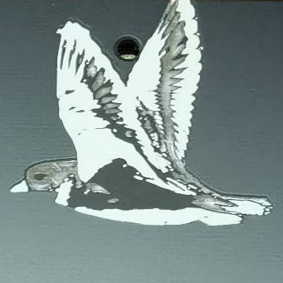

These are firmwares for the Uni v3 (with the USB C port). If you have an older Uni, check the v2 directory.

-----

The `default` versions have the home position with your thumbs spread out away from your palms. If you'd prefer to have your thumbs tucked in closer and to reach out for the number keys, use the `thumbs_in` versions.

Versions with `repeat` allow you to double-tap-and-hold a chord to auto-repeat it: handy for navigation. Repeat speed depends on how fast you double-tap.

Versions with `1up` send the chord as soon as you release the first key, allowing you to (for instance) hold your right-hand fingerspelling chord and just tap the letters on the left hand. Note that this may give you lots of misstrokes depending on your stroking technique.

-----

To install this firmware on your device:

This is a lot of steps but each one is pretty simple. I'm trying to go into full detail so you don't need to have any prior experience. And I'm adding some steps that may be unnecessary but sometimes do avoid problems.

* Download the firmware file you want (click on the filename, then click on "Raw" just above all the gibberish, then Ctrl+S or Apple+S to save it). Put it somewhere you can find it.
* Download the [QMK Toolbox][1] software (under the Assets section: you may have to click the arrow to expand it):
  * For Windows: `qmk_toolbox_install.exe`
  * For Mac: `QMK.Toolbox.pkg`
* Quit Plover.
* Run QMK Toolbox. It may ask you if you want to install drivers: say yes.
* In the "Local file" section at the top of the QMK Toolbox window, click Open and find your firmware file.
* Plug in the Uni.
* Push the reset button on the Uni. There's an access hole on the back, between the wings of the upper bird. A toothpick or ballpoint-pen refill should work to reach it. You'll feel the button click in; QMK Toolbox will probably print a message, and you may hear a "device connected" (or disconnected?) sound from your computer.
* Click the "Flash" button in QMK Toolbox.
* When it's done flashing, close QMK Toolbox to make sure it's not competing with Plover for access to the Uni.
* You may also need to unplug and replug the Uni.
* Restart Plover and you should be good to go!

[1]: https://github.com/qmk/qmk_toolbox/releases/latest
